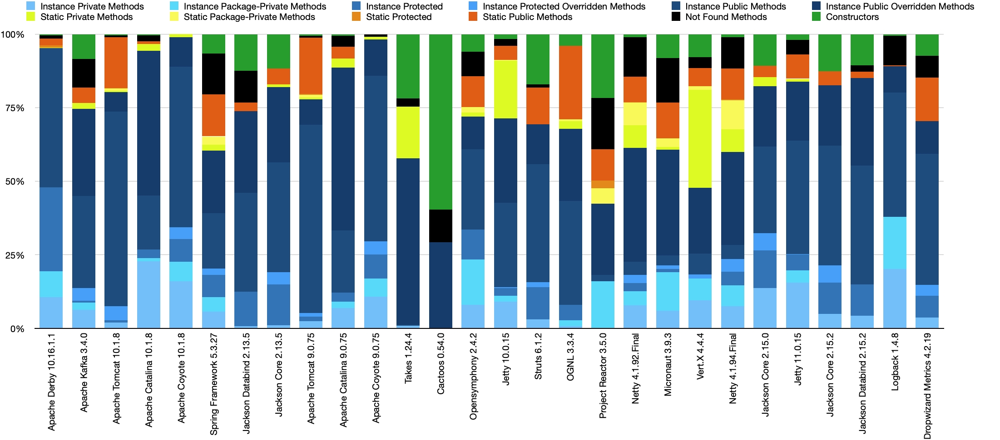

# Statistics of application methods profiling

This repository contains the code that aggregates the profiling results received
during the profiling of different applications (
see [cost-of-oop](https://github.com/volodya-lombrozo/cost-of-oop) for profiling
scripts and applications). The final results of method usage is presented in the
following histogram:

On the X axis you can see the list of libraries that was analysed.
On the Y axis you can see the percent of methods that were used in the
application in the corresponding library.

If you need aggregated data for the future analysis you can download the raw
CSV file [here](libraries-new.csv). The columns of the CSV file are:

- **Application** - the name of the tested application
- **Total** - total number of methods that were counted during
  profiling (
  including lambdas, constructors, static/instance methods)
- **Instance Private Methods** - total number of private instance methods that
  were counted during profiling
- **Instance Package-Private Methods** - total number of package-private
  instance methods that were counted during profiling
- **Instance Protected Methods** - total number of protected instance methods
  that were counted during profiling
- **Instance Protected Overridden Methods** - total number of protected
  instance methods that were counted during profiling that were overridden in
  the subclasses
- **Instance Public Methods** - total number of public instance methods that
  were counted during profiling
- **Instance Public Overridden Methods** - total number of public instance
  methods that were counted during profiling that were overridden in the
  subclasses
- **Static Private Methods** - total number of private static methods that
  were counted during profiling
- **Static Package-Private Methods** - total number of package-private static
  methods that were counted during profiling
- **Static Protected Methods** - total number of protected static methods that
  were counted during profiling
- **Static Public Methods** - total number of public static methods that were
  counted during profiling
- **Not Found Methods** - total number of methods that were not found in the
  source code (labdas, or methods in the inner classes).
- **Constructors** - total number of constructors that were counted during
  profiling
- **Instance Private Methods, %** - percent of private instance methods
  (Instance Private Methods / Total)
- **Instance Package-Private Methods, %** - percent of package-private instance
  methods (Instance Package-Private Methods / Total)
- **Instance Protected Methods, %** - percent of protected instance methods (
  Instance Protected Methods / Total)
- **Instance Protected Overridden, %** - percent of protected instance methods
  that were overridden in the subclasses (Instance Protected Overridden Methods
  / Total)
- **Instance Public Methods, %** - percent of public instance methods
  (Instance Public Methods / Total)
- **Instance Public Overridden Methods, %** - percent of public instance
  methods that were overridden in the subclasses (Instance Public Overridden
  Methods / Total)
- **Static Private Methods, %** - percent of private static methods (
  Static Private Methods / Total)
- **Static Package-Private Methods, %** - percent of package-private static
  methods (Static Package-Private Methods / Total)
- **Static Protected, %** - percent of protected static methods (
  Static Protected Methods / Total)
- **Static Public Methods, %** - percent of public static methods (
  Static Public Methods / Total)
- **Not Found Methods, %** - percent of methods that were not found in the
  source code (labdas, or methods in the inner classes) (
  Not Found Methods / Total)
- **Constructors, %** - percent of constructors (Constructors / Total)
- **GitHub Forks** - number of forks of the application repository on GitHub
- **GitHub Stars** - number of stars of the application repository on GitHub
- **GitHub Open Issues** - number of open issues of the application repository
  on GitHub
- **GitHub Size (KB)** - size of the application repository on GitHub
- **GitHub Age (ms)** - age of the application repository on GitHub

-
- **Static Methods** - total number of static methods that were counted during
  profiling
- **Constructors** - total number of constructors that were counted during
  profiling
- **Not Found Methods (lambdas)** - total number of methods that were not found
  in the source code, or labdas, or methods in the inner classes
- **Total Time (ms)** - total time spent in all methods
- **Time in Static Methods (ms)** - total time spent in static methods
- **Time in Intense Methods (ms)** - total time spent in instance methods
- **Time in Constructors Methods (ms)** - total time spent in constructors
- **Percent of Static Methods** - percent of time spent in static methods (
  Static Methods / Total Methods)
- **Percent of Instance Methods** - percent of time spent in instance methods (
  Instance Methods / Total Methods)
- **Percent of Constructors** - percent of time spent in constructors (
  Constructors / Total Methods)
- **Percent Not Found Methods** - percent of time spent in not found methods (
  Not Found Methods / Total Methods)
- **Percent Dirty Static Methods** - percent of time spent in static methods
  plus not found methods ( (Static Methods + Not Found Methods) / Total Methods)
- **Percent Dirty Instance Methods** - percent of time spent in instance methods
  plus not found methods ( (Instance Methods + Not Found Methods) / Total
  Methods)

The raw profiling results by methods you can
get [here](https://github.com/volodya-lombrozo/cost-of-oop/tree/main/results)

